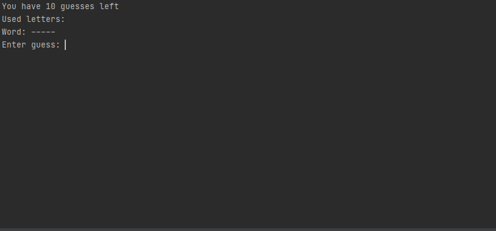

# EvilHangman

This program simulates a game of hangman, but cheats by not picking a word at the beginning.
The algorithm changes the bank of possible words depending on your guess in an attempt to cheap and win.
Once you guess a letter it simulates each position the letter could be in and picks the position that leads to the most possible words in the future.

For example, if the possible word list was: *{ALLY, BEST, COOL, DEAL, ECHO, ELSE, FLEW, GOOD, HEAL, HOPE, LAZY}* and the user guesses the letter "E" we would create 6 new lists:
- E--- (contains *{ECHO}*)
- -E-- (contains *{BEST, DEAL, HEAL}*)
- --E- (contains *{FLEW}*)
- ---E (contains *{HOPE}*)
- E--E (contains *{ELSE}*)
- ---- (contains *{ALLY, COOL, GOOD, LAZY}*)

In this case, we would select group 6, where the "E" is not used, as it produces the longest list of possible words.

We complete this process until the user runs out of guesses (the AI wins) or the program runs out of words (user wins).

## Usage

```java EvilHangman *dictionary* *wordLength* *guesses*```

#### Example

```java EvilHangman dictionary.txt 5 10```


